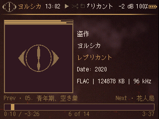
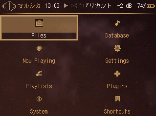

# elmas-diary

A Rockbox theme for the **HiFi Walker H2** (320×240, 16-bit, `erosqnative`). Inspired by Yorushika's *Elma's Diary* cover — oxblood leather, amber gold, off-white text.




## What you get

- **WPS** — album art, peak meters, metadata, custom progress bar with knob
- **Status bar** — Yorushika logo, clock, play/shuffle/repeat, now-playing title, volume, battery
- **Root menu** — 2×4 tile grid with icon + label per item
- **Submenus** — list rows with icons; now-playing and queued tracks marked in playlists
- **Japanese UI** — 13px Sazanami Mincho font

## Install on the H2

1. Connect the player via USB.
2. Copy this repo's `.rockbox/` folder into the player's `/.rockbox/` (merge; do not wipe the tree).
3. Confirm `13-Sazanami-Mincho.fnt` is in `/.rockbox/fonts/`.
4. On device: **Settings → Theme Settings → Browse Theme Files → elmas-diary**.

## Test on Windows (simulator)

Keep the simulator **outside** this repo (`C:\RockboxSim` is fine). The sim is large. It is not theme source.

1. Download the latest **erosqnative** build from [rockbox-sim-builds](https://github.com/adriankeenan/rockbox-sim-builds/releases/latest) (`rockboxui-win32-aigo-eros-q-k-native-…zip`).
2. Extract and run `rockboxui.exe` once to create `simdisk/`.
3. Sync the theme:

```powershell
cd C:\git\elmas-diary
.\scripts\sync-to-sim.ps1
```

4. Run the sim. Use `--debugwps` if a skin fails to load:

```powershell
.\rockboxui.exe --debugwps
```

5. Reload the theme: **Settings → Theme Settings → Browse Theme Files → elmas-diary**.

| Key | Action |
|-----|--------|
| Numpad 8 / Up | Up |
| Numpad 2 / Down | Down |
| Numpad 4 / Left | Previous |
| Numpad 6 / Right | Next |
| Numpad 5 / Enter | Select |
| Numpad 0 / Esc | Back |

Put test music under `simdisk/` to preview the WPS.

## Change the theme

1. Edit skin files in `.rockbox/wps/` and colors in `.rockbox/themes/elmas-diary.cfg`.
2. Regenerate BMPs if you change the palette or icon art: `python scripts/generate-assets.py`
3. Sync: `.\scripts\sync-to-sim.ps1`
4. Copy `.rockbox/` to the player when ready.

See **[THEME_GUIDE.md](THEME_GUIDE.md)** for how the pieces fit together, tag syntax, icons, and pitfalls.

## Repository layout

```
.rockbox/
├── themes/elmas-diary.cfg       # colors, font, paths, peak meter
├── fonts/13-Sazanami-Mincho.fnt
├── icons/elmas-diary-icons.bmp  # menu icon strip
├── icons/elmas-diary-viewers.bmp
├── wps/elmas-diary.wps          # music screen
├── wps/elmas-diary.sbs          # status bar + menus
└── wps/elmas-diary/*.bmp        # backdrop, progress bar, status icons

scripts/
├── generate-assets.py           # build all BMPs from palette + logo
├── sync-to-sim.ps1              # push theme to simulator
└── analyze-peaks.py             # optional peak-meter tuning

assets/yorushika-logo.png        # source for status bar eye logo
```

## References

- [Rockbox WPS tags (CustomWPS)](https://www.rockbox.org/wiki/CustomWPS)
- [HiFi Walker H2 / Eros Q](https://www.rockbox.org/wiki/AIGOErosQK)
- [d00k.net theming intro](https://d00k.net/wiki/rockbox_theming/introduction/)
